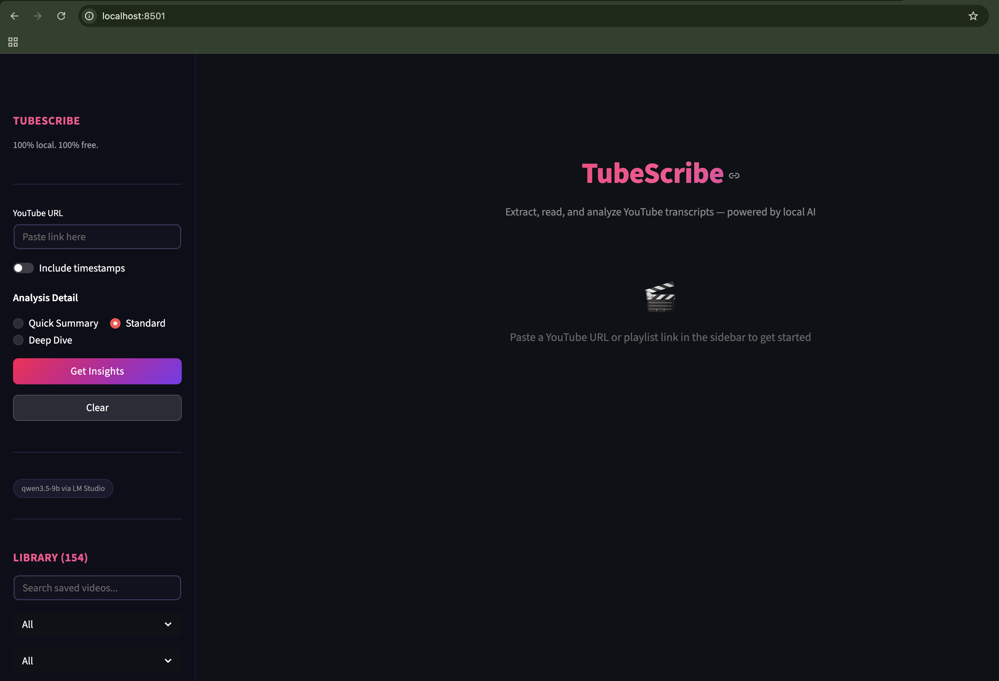

# TubeScribe

100% local YouTube transcript scraper and analyzer. Extract, read, and analyze YouTube transcripts — powered by local AI.

No API keys. No cloud. Everything runs on your machine.



## Features

- **Transcript Extraction** — Fetch transcripts from any YouTube video or playlist. Falls back to Whisper for videos without captions.
- **AI-Powered Analysis** — Three detail levels (Quick Summary, Standard, Deep Dive) using a local LLM via LM Studio.
- **Key Quotes Extraction** — Automatically pulls out the most quotable/shareable lines with timestamps.
- **Speaker Identification** — Detects speakers in interviews and multi-person videos.
- **Searchable Library** — SQLite + FTS5 full-text search across all saved transcripts and insights.
- **Auto-Tagging** — LLM-generated topic tags for every video.
- **Collections** — Organize videos into custom groups (e.g. "Tech Talks", "Marketing").
- **Playlist Support** — Batch-process entire playlists with progress tracking. Handles all YouTube URL formats including `/show/`, `watch?v=...&list=...`, and standard playlist links.
- **Q&A Chat** — Ask follow-up questions about any video's content.
- **Export** — Copy analysis or download as Markdown.

## Requirements

- **Python 3.9+**
- **[LM Studio](https://lmstudio.ai/)** — running locally with any compatible model loaded

## Setup

1. Clone the repo:

```bash
git clone https://github.com/omkartphatak/tubescribe.git
cd tubescribe
```

2. Install dependencies:

```bash
pip install -r requirements.txt
```

> **Optional:** If you need Whisper fallback for videos without captions:
> ```bash
> pip install openai-whisper
> ```

3. Install [LM Studio](https://lmstudio.ai/) and load a model (e.g. `qwen/qwen3.5-9b`)

4. Start the LM Studio local server (default port: 1234)

5. **(Optional)** Configure your model and URL — copy `.env.example` to `.env` and edit:

```bash
cp .env.example .env
```

```env
LM_STUDIO_URL=http://localhost:1234/v1
LM_STUDIO_MODEL=qwen/qwen3.5-9b
```

6. Run the app:

```bash
streamlit run app.py
```

## Configuration

| Environment Variable | Default | Description |
|---|---|---|
| `LM_STUDIO_URL` | `http://localhost:1234/v1` | LM Studio API endpoint |
| `LM_STUDIO_MODEL` | `qwen/qwen3.5-9b` | Model identifier loaded in LM Studio |

Set these in a `.env` file or export them in your shell.

## Project Structure

```
app.py              — Streamlit web UI
transcript_agent.py — Core logic: transcript fetching, LLM analysis, quotes, tags
database.py         — SQLite persistence layer with FTS5 search
cli.py              — CLI interface
batch_fetch.py      — Batch transcript fetching
analyze_batch.py    — Batch analysis
generate_report.py  — Report generation
whisper_batch.py    — Batch Whisper transcription
```

## License

AGPL-3.0-only
